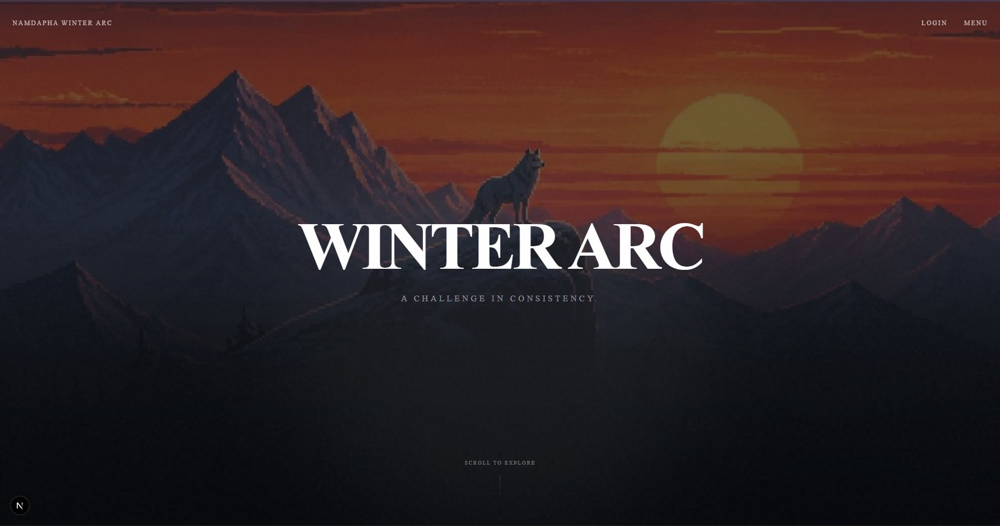
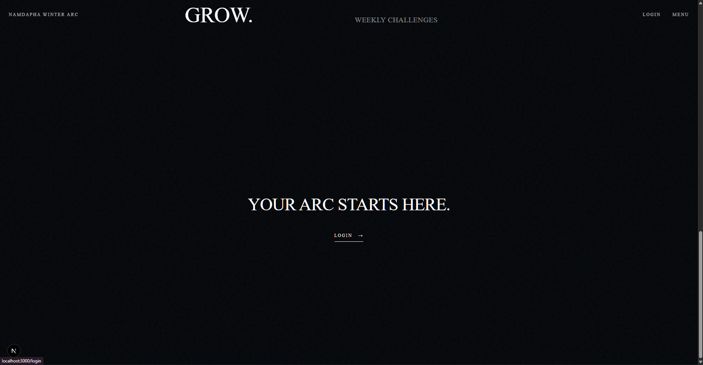
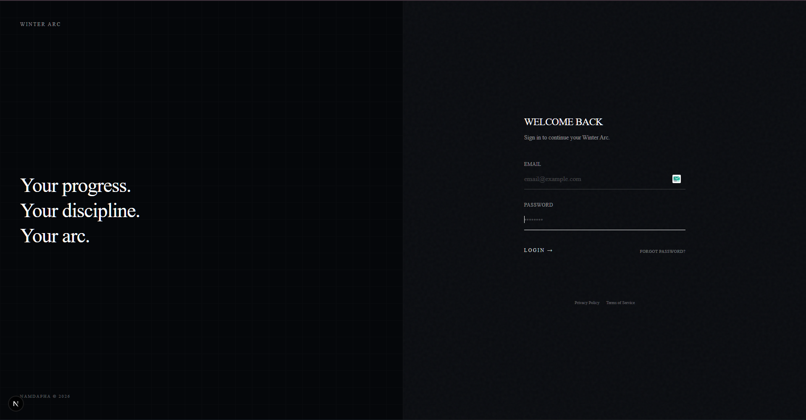
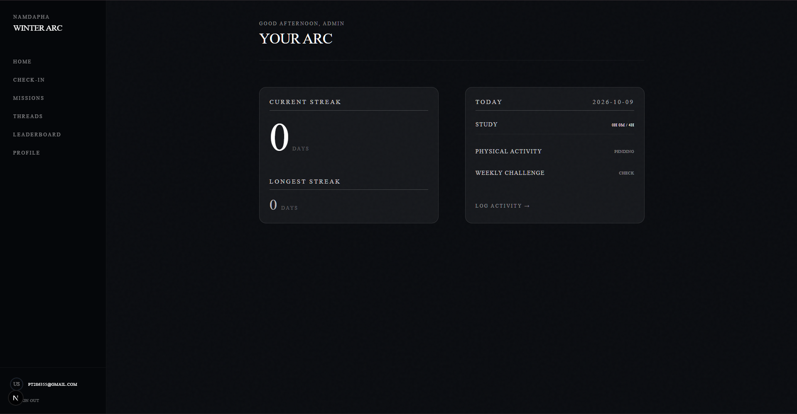
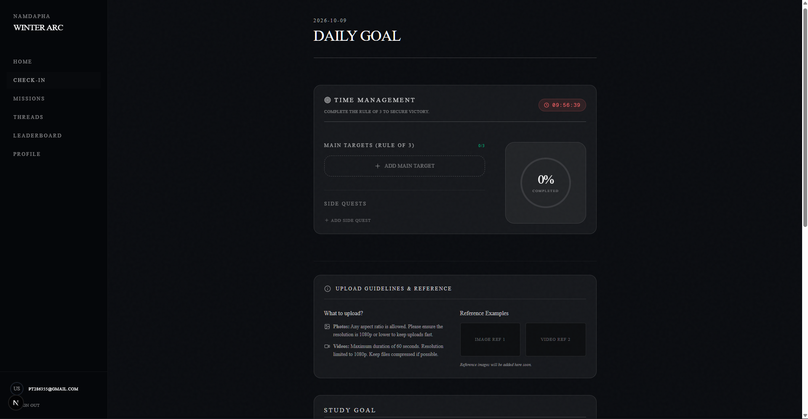
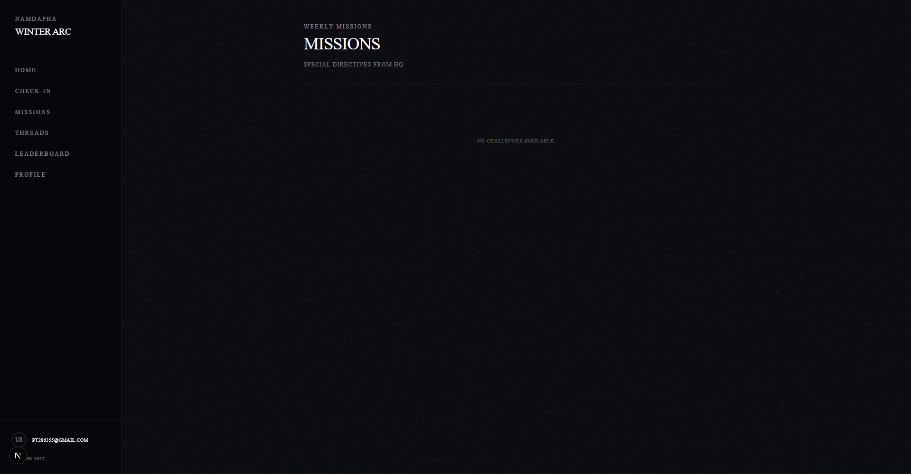
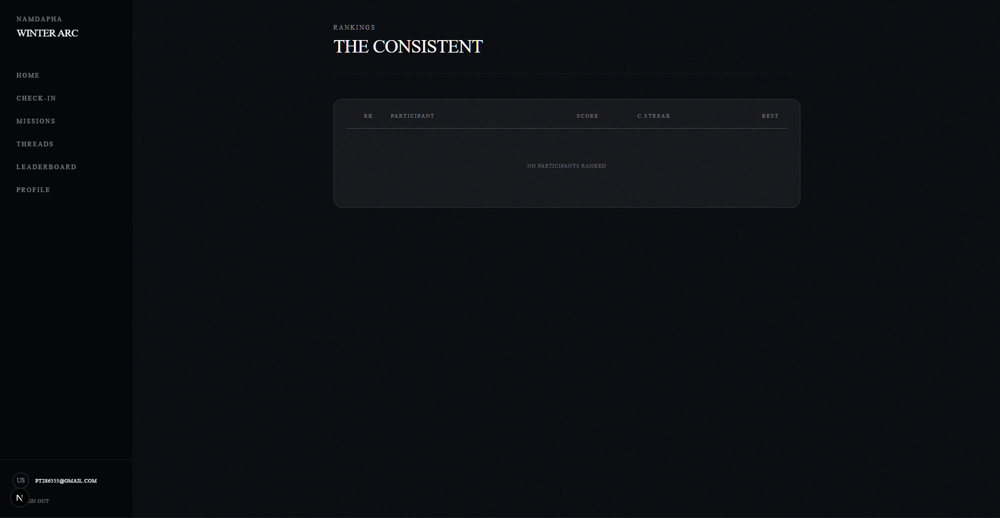
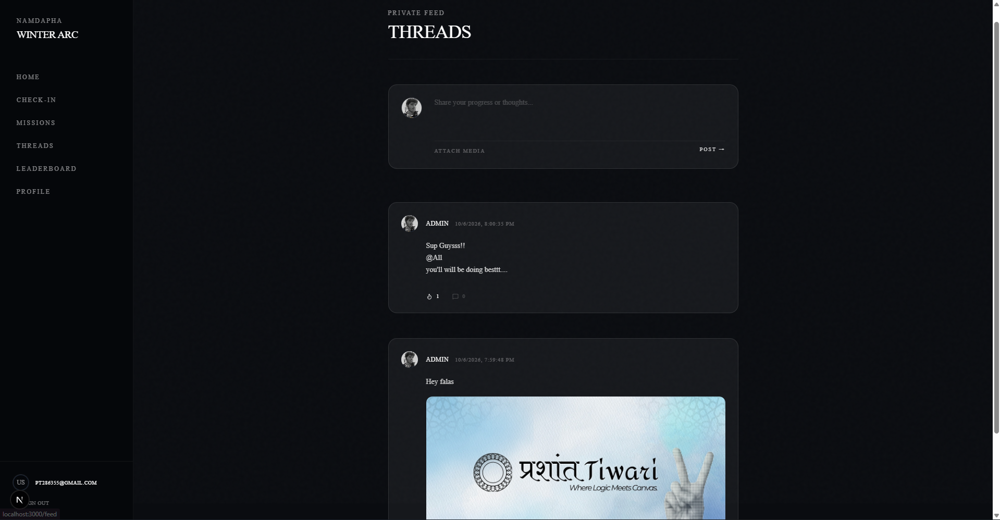
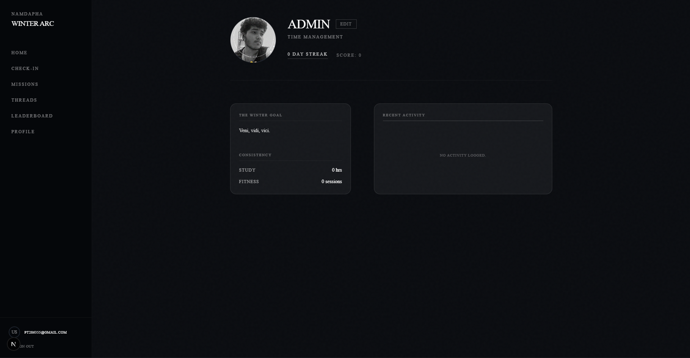

# Winter Arc ❄️

> **A challenge in consistency.**

## Overview
The Winter Arc is a commitment to self-improvement during the final months of the year. This platform helps you track your daily non-negotiables, log workouts, and stay consistent with your goals when most people give up.

## Tech Stack
- **Framework:** Next.js (App Router)
- **UI/Components:** React, Tailwind CSS, Lucide React
- **Backend/Auth:** Supabase
- **Language:** TypeScript

## User Workflow & Experience

### 1. The Landing Page 
When you first arrive, you're greeted by a premium, interactive landing page designed to set the tone for your Winter Arc.

- **Explore Core Values:** Scroll down to discover the pillars of the challenge: **Show Up** (3+ hours/day), **Move** (3 sessions/week), and **Grow** (Weekly challenges).
- **Navigation:** The top navigation bar gives you quick access to the platform. 
- **Quick Info (Menu):** Click the **MENU** button to open a sleek popup containing project details, the tech stack, developer credits, and a link to this repository.

- **Ready to begin?** Click the **LOGIN** button in the top right, or scroll to the final call-to-action to proceed.

### 2. Authentication 
You will be redirected to the secure **Login Page**.

Here, you can securely sign in or create a new account to unlock your dashboard.

### 3. Main Dashboard & Features
Once authenticated, you gain access to your personalized tracker:

- **Daily Check-Ins:** A dedicated space to log your daily non-negotiables (e.g., diet, reading, work hours).

- **Progress & Missions:** Visualize your consistency over time. See how many days you've successfully completed the arc and track your current missions.

- **Leaderboard:** See how you stack up against others and stay motivated.

- **Community Feed:** Share your wins, view posts from others, and maintain accountability on the public thread.

- **Profile Customization:** Edit your personal details and adjust your goals dynamically.

## Credits
Built with focus and dedication by:
- **Prashant Tiwari**
- **Aman**
- **Nitish**
- **Sneh**

---
*Your arc starts here.*
